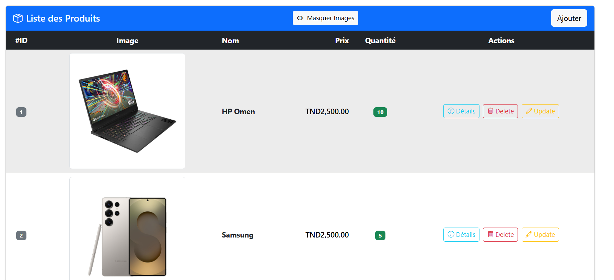

# Product Management Web Application

A simple **full-stack web application** to manage products, built with **Spring Boot** for the backend and **Angular** for the frontend. This app allows users to **create, read, update, and delete (CRUD)** products with attributes like name, price, quantity, and image.



---


## Features

- Add new products with name, price, quantity, and optional image.
- Update existing products with current values prefilled.
- Delete products with a confirmation prompt.
- Search products by name.
- Display product list with images and details.
- Responsive and user-friendly interface.

---

## Technology Stack

### Backend
- Spring Boot
- Spring Data JPA
- H2 / MySQL (configurable)
- REST API for CRUD operations
- File upload for product images

### Frontend
- Angular 15+
- TypeScript
- Bootstrap 5 for styling
- SweetAlert2 for modals and confirmations
- Reactive forms for add/update operations

---

## Prerequisites

- Java 11+ (for Spring Boot)
- Node.js 16+ and npm (for Angular)
- Angular CLI installed globally (`npm install -g @angular/cli`)
- IDE or editor (VS Code, IntelliJ, Eclipse, etc.)
- Optional: MySQL database if not using in-memory H2

---

## Setup Instructions

### 1. Backend (Spring Boot)

1. Clone the repository:

```bash
git clone <repo-url>
cd backend
